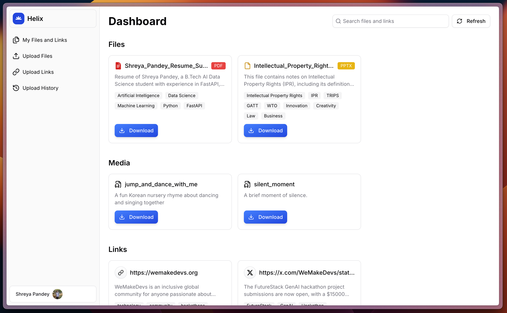

# Helix: L1 Cache for LLMs

🌐 Website: [helix-llm.app](https://helix-llm.app)  
🔌 MCP Gateway: [helix-mcp](./helix-mcp)

---

## Introduction

<p align="center">
  
</p>

LLMs are smart, but they forget your context.  
Every prompt feels like starting from zero.

**Helix fixes that.**  
It’s the **L1 cache for your LLMs**.

You can dump in your files PDFs, YouTube videos, documents, even audio and Helix makes them instantly searchable.With support for **20+ file types**, Helix ensures you can bring in almost any kind of knowledge source seamlessly.

Then you connect Helix to your favorite LLM **ChatGPT, Claude, or Llama** and it instantly gets a **super-fast search tool**, powered by:

- ⚡ **[Cerebras Systems](https://www.cerebras.net/)** for blazing-fast inference and indexing  
- 🐳 **[Docker MCP Gateway](https://github.com/docker/mcp)** for modular tool integration  
- 🦙 **[Llama](https://ai.meta.com/llama/)** providing the intelligence layer

Together, these make Helix **super fast, reliable, and context-aware**, so your AI always has the right memory at the right time.

---

## Dashboard Preview



---

## System Architecture


Helix is designed as a **modular system** that wraps LLMs with a fast, context-aware caching layer.
The two main components that make up Helix are:

### 1. Web Application
- Users **log in** and **upload files or links** (PDFs, YouTube videos, documents, audio).
- The web app connects to **MCP servers**, which host tools to help LLMs **respond to prompts and retrieve context efficiently**.
- Users can then **plug MCP servers into their preferred LLM** (ChatGPT, Claude, Llama) to enable context-aware responses.

### 2. Chrome Extension
- Allows users to **save links directly while browsing**, with just one click.
- Works as a lightweight, complementary tool to the web app, making **context capture seamless**.

### Overall Flow
1. User interacts with **web app** or **Chrome extension** to provide content.  
2. Helix **processes, converts, and stores content** in the memory library.  
3. MCP servers serve as the **bridge between the memory library and any LLM**, enabling fast, context-rich responses.  
4. The system ensures that the **LLM always has the right context**, no matter the file type or source.

---

## Repository Structure

```plaintext
helix/
│── chrome_extension/   # Chrome extension for one-click link saving
│   └── README.md
│
│── frontend/           # Frontend web application (login, upload, UI)
│   └── README.md
│
│── helix-mcp/          # MCP servers for tools and LLM integration
│   └── README.md
│
│── service/            # Backend services: markdown conversion, caching, file mgmt
│   └── README.md
│
└── README.md           # Root README (this file)
```

### Folder Purpose Overview

- **chrome_extension/**  
  Save links directly from the browser to Helix’s memory library.  

- **frontend/**  
  User-facing interface for uploading and managing content, displaying search results, and interacting with LLMs.  

- **helix-mcp/**  
  MCP servers that host tools to support LLM prompts and retrieval from the memory library.  

- **service/**  
  Handles core backend logic including file processing, markdown conversion, memory library management, and caching.  

> Each folder contains its own `README.md` with instructions on setup and usage.  
> Check them out to learn how to get started with those components.
---

## Features

Helix acts as the ultimate knowledge layer for your LLMs, offering a unique set of features that combine content ingestion, advanced indexing, and seamless LLM integration.

#### 1. Core Intelligence & Speed

* **L1 Cache for LLMs:** Provides ultra-fast context retrieval, ensuring your LLM can access specific knowledge in milliseconds, not minutes.
* **Powered by Cerebras Inferencing:** We leverage **Cerebras Inferencing** in our backend services to build the memory library, enabling highly efficient and accurate indexing, vectorization, and retrieval of uploaded context.
* **Llama Intelligence Integration:** The system integrates **Llama Intelligence** with the **Searx** search tool, allowing for sophisticated, context-aware search capabilities over your entire knowledge base.

#### 2. Universal Content Ingestion

* **Multi-Modal Upload:** Easily upload and process a wide variety of file types, including **PDFs, documents (DOCX, TXT), audio files, and video links (YouTube)**.
* **Automatic Conversion:** All ingested content is automatically extracted, cleaned, and converted into structured **markdown** for uniform storage and optimal retrieval quality.
* **One-Click Capture (Chrome Extension):** The dedicated **Chrome Extension** lets you save web links directly to your Helix memory library while browsing, making context capture seamless.

#### 3. Seamless Integration

* **LLM Agnostic Context:** Helix can plug into popular models like **ChatGPT, Claude, and Llama** via the **MCP Servers**, instantly giving your favorite chat model access to your private knowledge base.
* **Modular Control Plane (MCP) Servers:** These servers host specialized tools that provide LLMs with the capability to perform highly targeted search and retrieval operations, acting as the intelligent bridge between the LLM and the memory library.

---
## Authors

- [Adarsh Dubey](https://github.com/inclinedadarsh)  
- [Shreya Pandey](https://github.com/shreyap2702)  
- [Aditya Borse](https://github.com/aditya-borse)  

---

## License

This project is licensed under the **MIT License**. See the `LICENSE` file for details.
