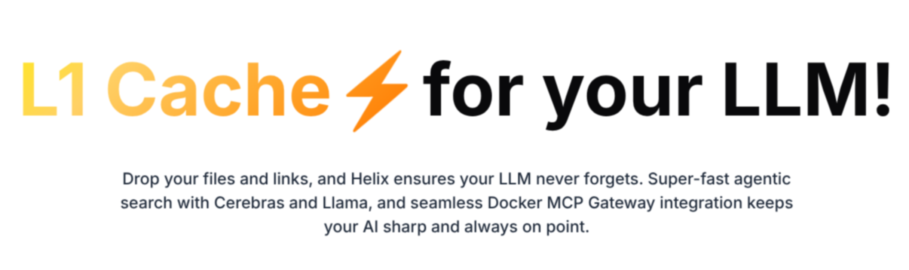
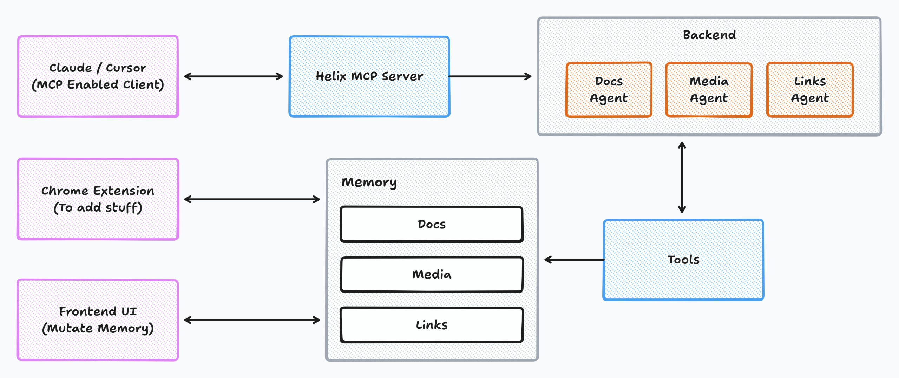
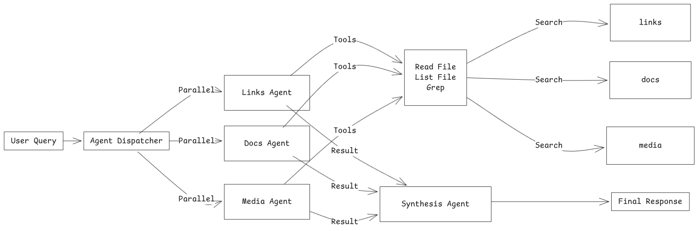

# Helix: L1 Cache for LLMs

- 🌐 Website: [helix-llm.app](https://helix-llm.app)
- 🔗 Sign up on [helix-llm.app](https://helix-llm.app) to use Helix MCP: [MCP Server URL](https://helix-mcp-server.borse-aditya7.workers.dev/mcp)
- 🔌 Docker MCP Gateway: [PR made to Docker MCP registry to add Helix MCP Server to Docker MCP gateway](https://github.com/docker/mcp-registry/pull/313)

---

## Introduction

<p align="center">
  
</p>

LLMs are smart, but they forget your context.  
Every prompt feels like starting from zero.

**Helix fixes that.**  
It’s the **L1 cache for your LLMs**.

You can dump in your files PDFs, YouTube videos, documents, even audio and Helix makes them instantly searchable.With support for **20+ file types**, Helix ensures you can bring in almost any kind of knowledge source seamlessly.

Then you connect Helix to your favorite LLM chat app like **ChatGPT, Claude, or even Cursor** and it instantly gets a **super-fast search tool**, powered by:

- ⚡ **[Cerebras Systems](https://www.cerebras.net/)** for blazing-fast inference and indexing  
- 🦙 **[Llama](https://ai.meta.com/llama/)** providing the intelligence layer
- 🐳 **[Docker MCP Gateway](https://github.com/docker/mcp)** allows you to run Helix MCP Server in a container and use it with any MCP-compatible client 

Together, these make Helix **super fast, reliable, and context-aware**, so your AI always has the right memory at the right time.

---

## Dashboard Preview


---

## System Architecture



## Multi-Agent Search System



---

Helix is designed as a **modular system** that wraps LLMs with a fast, context-aware caching layer.
The two main components that make up Helix are:

### 1. Web Application
- Users **log in** and **upload files or links** (PDFs, YouTube videos, documents, audio).
- Users can then **plug the Helix MCP into their preferred LLM chat app** (ChatGPT, Claude, Cursor etc.) to enable context-aware responses.

### 2. Chrome Extension
- Allows users to **save links directly while browsing**, with just one click.
- Works as a lightweight, complementary tool to the web app, making **context capture seamless**.

### Overall Flow
1. User interacts with **web app** or **Chrome extension** to provide content.  
2. Helix **processes, converts, and stores content** in the memory library.  
3. Helix MCP serves as the **bridge between the memory library and any LLM**, enabling fast, context-rich responses.  
4. The system ensures that the **LLM always has the right context**, no matter the file type or source.

---

## Repository Structure

```plaintext
helix/
│── chrome_extension/   # Chrome extension for one-click link saving
│   └── README.md
│
│── frontend/           # Frontend web application (login, upload, UI)
│   └── README.md
│
│── helix-mcp-remote/   # Helix Remote MCP Server
│   └── README.md
│
│── helix-mcp-docker/   # For Docker MCP Gateway Integration
│   └── README.md
│
│── service/            # Backend services: file processing, storage and multi-agent search
│   └── README.md
│
└── README.md           # Root README (this file)
```

### Folder Purpose Overview

- **chrome_extension/**  
  Save links directly from the browser to Helix’s memory library.  

- **frontend/**  
  User-facing interface for uploading and managing content, displaying search results, and interacting with LLMs.  

- **helix-mcp-remote/**  
  Helix Remote MCP Server that enables any MCP enabled client to retrieve context from the memory library.  

- **helix-mcp-docker/**  
  For Docker MCP Gateway Integration

- **service/**  
  Backend services: file processing, storage and multi-agent search.  


> Each folder contains its own `README.md` with instructions on setup and usage.  
> Check them out to learn more about each component of the project.

---

## Features

Helix acts as the ultimate knowledge layer for your LLMs. It offers a unique set of features that combine content ingestion, processing, and seamless LLM integration.

#### 1. Core Intelligence & Speed

* **L1 Cache for LLMs:** Provides super fast search, ensuring your LLM can access specific knowledge in seconds, not minutes.
* **Powered by Cerebras Inferencing:** We leverage **Cerebras Inferencing** to make our search agents and file processing super fast.
* **Llama Intelligence:** Our search agents are powered by the intelligence of **Llama models**.

#### 2. Universal Content Ingestion

* **Multi-Modal Upload:** Easily upload and process a wide variety of file types, including **PDFs, documents (DOCX, TXT), audio files, and video links (YouTube)**.
* **Automatic Conversion:** All uploaded content is automatically processed and converted into structured **markdown** for uniform storage and optimal retrieval quality.
* **One-Click Capture (Chrome Extension):** The dedicated **Chrome Extension** lets you save web links directly to your Helix memory library while browsing, making context capture seamless.

#### 3. Seamless Integration

* **LLM Agnostic Context:** Helix MCP can plug into popular apps like **ChatGPT, Claude, Cursor etc.** instantly giving your favorite chat apps access to your private knowledge base.
* **Docker MCP Gateway Integration:** You can run Helix MCP Server in a container and use it with any MCP-compatible client.

---
## Built with ❤️ by

- [Adarsh Dubey](https://github.com/inclinedadarsh)
- [Shreya Pandey](https://github.com/shreyap2702) 
- [Aditya Borse](https://github.com/aditya-borse) 

---

## License

This project is licensed under the **MIT License**. See the [LICENSE](./LICENSE) file for details.
