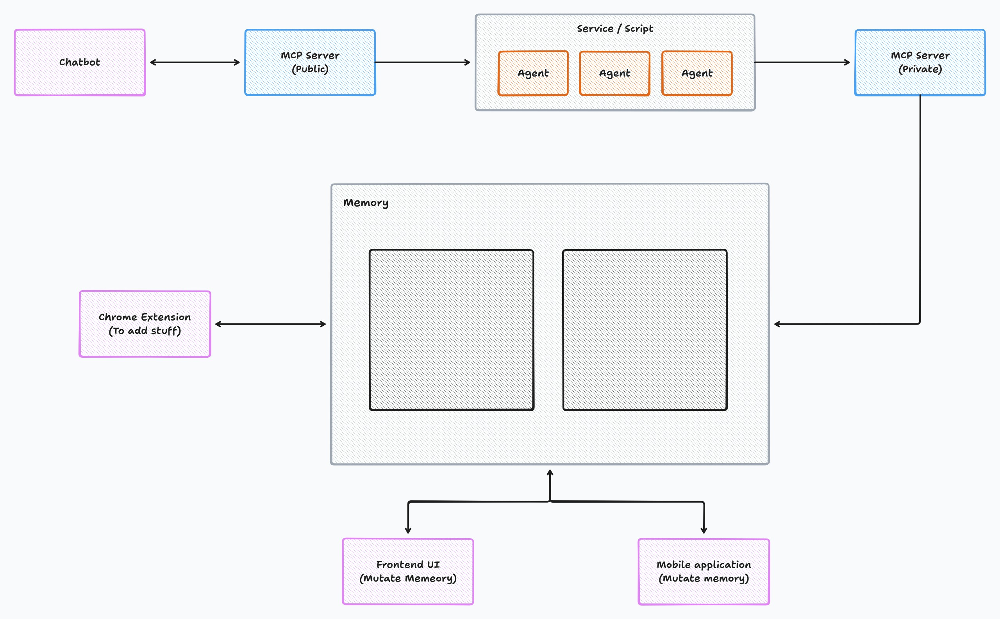

# Helix: L1 Cache for LLMs

## Contents

1. [Introduction](#introduction)
2. [System Architecture](#system-architecture)
3. [Repository Structure](#repository-structure)
4. [Features](#features)
5. [Installation](#installation)
6. [Running Locally](#running-locally)
7. [Usage](#usage)
8. [License](#license)
9. [Contributing](#contributing)
10. [Contact](#contact)

---

## Introduction

 

LLMs are smart, but they forget your context.
Every prompt feels like starting from zero.

**Helix fixes that.**
It’s the **L1 cache for your LLMs**.

You can dump in your files — PDFs, YouTube videos, documents, even audio — and Helix makes them instantly searchable.

Then you connect Helix to your favorite LLM — **ChatGPT, Claude, or Llama** — and it instantly gets a **super-fast search tool**, powered by **Searx** and **Llama Intelligence**.
Any file you uploaded becomes searchable in seconds.

That means your AI always has the right context, so you get the right answers — every time.

---

### Workflow

1. **Login** → User logs into the Helix webapp.
2. **Upload Content** → Files/links (PDFs, videos, docs, audio, etc.) are uploaded.
3. **Markdown Conversion** → Content is extracted & converted into clean markdown.
4. **Memory Library (Cerebras Inferencing)** → Files are renamed, stored, and indexed into a memory library.
5. **MCP Servers** → Connected to MCP servers which host tools for prompt responses & retrieval.
6. **LLM Integration** → Users plug our MCP servers into their favorite chat model (ChatGPT, Claude, Llama, etc.).
7. **Chrome Extension** → Save links with one click while browsing, instantly adding them to your memory library.

---

## System Architecture



Helix is designed as a **modular system** that wraps LLMs with a fast, context-aware caching layer.
The two main components that make up Helix are:

### 1. Web Application
- Users **log in** and **upload files or links** (PDFs, YouTube videos, documents, audio).
- The web app connects to **MCP servers**, which host tools to help LLMs **respond to prompts and retrieve context efficiently**.
- Users can then **plug MCP servers into their preferred LLM** (ChatGPT, Claude, Llama) to enable context-aware responses.

### 2. Chrome Extension
- Allows users to **save links directly while browsing**, with just one click.
- Works as a lightweight, complementary tool to the web app, making **context capture seamless**.

### Overall Flow
1. User interacts with **web app** or **Chrome extension** to provide content.
2. Helix **processes, converts, and stores content** in the memory library.
3. MCP servers serve as the **bridge between the memory library and any LLM**, enabling fast, context-rich responses.
4. The system ensures that the **LLM always has the right context**, no matter the file type or source.

> Together, the **web app** and **Chrome extension** wrap Helix into a full-fledged project, providing a seamless way to **ingest, store, and retrieve knowledge for LLMs**.

---

## Repository Structure

The Helix repository is organized to separate **core logic, frontend, MCP servers, services, and Chrome extension**.
Here’s an overview of the main directories and files:
helix/
│── chrome_extension/ # Chrome extension for one-click link saving
│── frontend/ # Frontend web application (user login, file uploads, UI)
│── helix-mcp/ # MCP servers for tools and LLM integration
│── service/ # Backend services: markdown conversion, caching, file management
└── README.md # This README


### Folder Purpose Overview

- **chrome_extension/** → Save links directly from the browser to Helix’s memory library.
- **frontend/** → User-facing interface for uploading and managing content, displaying search results, and interacting with LLMs.
- **helix-mcp/** → MCP servers that host tools to support LLM prompts and retrieval from the memory library.
- **service/** → Handles core backend logic including file processing, markdown conversion, memory library management, and caching.

> This structure ensures **modularity, maintainability, and ease of use**, allowing developers and users to quickly understand and extend Helix.

---

## Features

Helix acts as the ultimate knowledge layer for your LLMs, offering a unique set of features that combine content ingestion, advanced indexing, and seamless LLM integration.

### 1. Core Intelligence & Speed

* **L1 Cache for LLMs:** Provides ultra-fast context retrieval, ensuring your LLM can access specific knowledge in milliseconds, not minutes.
* **Powered by Cerebras Inferencing:** We leverage **Cerebras Inferencing** in our backend services to build the memory library, enabling highly efficient and accurate indexing, vectorization, and retrieval of uploaded context.
* **Llama Intelligence Integration:** The system integrates **Llama Intelligence** with the **Searx** search tool, allowing for sophisticated, context-aware search capabilities over your entire knowledge base.

### 2. Universal Content Ingestion

* **Multi-Modal Upload:** Easily upload and process a wide variety of file types, including **PDFs, documents (DOCX, TXT), audio files, and video links (YouTube)**.
* **Automatic Conversion:** All ingested content is automatically extracted, cleaned, and converted into structured **markdown** for uniform storage and optimal retrieval quality.
* **One-Click Capture (Chrome Extension):** The dedicated **Chrome Extension** lets you save web links directly to your Helix memory library while browsing, making context capture seamless.

### 3. Seamless Integration

* **LLM Agnostic Context:** Helix can plug into popular models like **ChatGPT, Claude, and Llama** via the **MCP Servers**, instantly giving your favorite chat model access to your private knowledge base.
* **Modular Control Plane (MCP) Servers:** These servers host specialized tools that provide LLMs with the capability to perform highly targeted search and retrieval operations, acting as the intelligent bridge between the LLM and the memory library.

---

## Installation

To set up and run Helix locally, you'll need to clone the repository and set up the individual components: the services, the frontend, and the MCP servers.

### Prerequisites

* Docker and Docker Compose (Recommended for easy setup)
* Node.js (for the `frontend` and `chrome_extension`)
* Python 3.x (for the `service` and `helix-mcp`)
* Required API keys (e.g., for Cerebras Inferencing, Llama Intelligence, and your chosen LLM) configured in environment variables.

### Steps

1.  **Clone the Repository:**
    ```bash
    git clone [https://github.com/your-username/helix.git](https://github.com/your-username/helix.git)
    cd helix
    ```

2.  **Service & MCP Setup (Recommended with Docker):**
    The easiest way to get the backend services and MCP servers running is by using Docker Compose.
    ```bash
    # Ensure you have your .env file configured with necessary keys
    docker-compose up -d --build service helix-mcp
    ```

3.  **Frontend Setup:**
    ```bash
    cd frontend
    npm install
    npm start
    # The webapp will typically run on http://localhost:3000
    ```

4.  **Chrome Extension Setup (Optional):**
    * Navigate to `chrome://extensions/` in your Chrome browser.
    * Enable **Developer Mode**.
    * Click **Load unpacked** and select the `helix/chrome_extension/` directory.

---

## Running Locally

Once you have completed the [Installation](#installation) steps, use the following commands to manage your local Helix instance.

1.  **Start All Services (Docker Compose):**
    If you used Docker Compose, this will start the backend (`service`) and the LLM bridge (`helix-mcp`).
    ```bash
    docker-compose up
    ```
2.  **Start the Frontend:**
    ```bash
    cd frontend
    npm start
    ```
3.  **Access the Application:**
    Open your browser and navigate to the address where the frontend is running (usually `http://localhost:3000`).

---

## Usage

Helix is designed to provide your LLM with a persistent, searchable memory. Here's a quick guide on how to use the system.

### 1. Ingesting Knowledge

* **Via Web App:**
    1.  Log into the **Helix web application**.
    2.  Use the "Upload" or "Add Link" feature in the UI.
    3.  Upload your documents (PDFs, docs) or paste links (YouTube, articles).
    4.  Helix processes the file, converts it to markdown, and indexes it into the **Memory Library** using **Cerebras Inferencing**.
* **Via Chrome Extension:**
    1.  Click the **Helix Chrome Extension** icon while viewing a web page you want to save.
    2.  The link is instantly added to your memory library, ready for the LLM to search.

### 2. Connecting to Your LLM

1.  Obtain the API/connection details for your local **MCP Servers** (this will depend on your local setup).
2.  Configure your favorite LLM client (**ChatGPT, Claude, Llama**, etc.) to use the **MCP Server** as an external "tool" or "plugin."
3.  The LLM can now call upon the MCP tool when a query requires accessing your uploaded context.

### 3. Querying Your Context

When interacting with your LLM, pose a question that relates to the files or links you uploaded.

* **Example Prompt:** "Based on the internal Q3 financial report I uploaded last week, what was the projected growth rate for the APAC region?"

The LLM will recognize that it needs external context, trigger the **MCP Server tool**, which executes a super-fast search over your **Cerebras-indexed memory library**, and provides the specific, relevant context to the LLM to formulate a precise answer.

---

## License

This project is licensed under the **MIT License**. See the `LICENSE` file for details.

---

## Contributing

We welcome contributions! Whether it's reporting a bug, suggesting a feature, or submitting a pull request, please see our `CONTRIBUTING.md` file for guidelines.

---

## Contact

For questions, feedback, or support, please reach out to:

* **Project Maintainer:** Adarsh Dubey
* **Email:** dubeyadarshmain@gmail.com