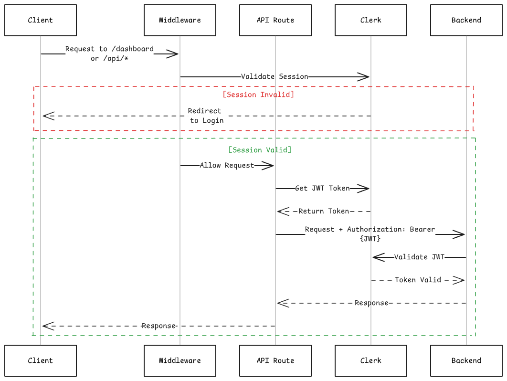

# Helix Frontend

Web application for the Helix - an L1 cache for your LLMs.

## Overview

The Helix frontend is a Next.js-based web application that serves as the primary user interface for uploading, managing, and accessing processed content.

The application enables users to:
- Upload documents, media files, and web URLs for processing
- Browse and search through processed content
- Download original files and processed metadata
- Track upload and processing status

## Technology Stack

- **Next.js**: 15
- **React**: 19
- **Clerk**: User authentication and session management
- **Tailwind CSS and Radix UI**: Styling and UI components

### Project Structure

```
frontend/
├── src/
│   ├── app/                      # Next.js App Router
│   │   ├── api/                  # API route handlers (proxy to backend)
│   │   │   ├── upload/           # File upload endpoint
│   │   │   ├── process-urls/     # URL processing endpoint
│   │   │   ├── files/            # Fetch processed files
│   │   │   ├── download/         # Download files
│   │   │   ├── delete/           # Delete files
│   │   │   └── processes/recent/ # Recent upload history
│   │   ├── dashboard/            # Protected dashboard routes
│   │   │   ├── page.tsx          # File browser and search
│   │   │   ├── upload/           # File upload interface
│   │   │   ├── upload-links/     # URL upload interface
│   │   │   └── upload-history/   # Process tracking
│   │   ├── layout.tsx            # Root layout
│   │   ├── page.tsx              # Landing page
│   │   └── globals.css           # Global styles
│   ├── components/               # React components
│   │   ├── ui/                   # Reusable UI components
│   │   ├── app-sidebar.tsx       # Dashboard navigation
│   │   ├── navbar.tsx            # Landing page navigation
│   │   └── shiny.tsx             # Marketing components
│   ├── lib/                      # Utility functions
│   │   ├── auth.ts               # Clerk authentication helpers
│   │   ├── env.ts                # Environment configuration
│   │   └── utils.ts              # General utilities
│   ├── hooks/                    # Custom React hooks
│   ├── assets/                   # Static assets (logos, icons)
│   └── middleware.ts             # Route protection middleware
├── public/                       # Public static files
├── package.json                  # Dependencies and scripts
├── tsconfig.json                 # TypeScript configuration
├── next.config.ts                # Next.js configuration
├── biome.json                    # Biome configuration
└── tailwind.config.js            # Tailwind CSS configuration
```

## Authentication Flow



### API Routes

All API routes are protected by Clerk middleware and proxy requests to the backend:

| Route | Method | Purpose | Backend Endpoint |
|-------|--------|---------|------------------|
| `/api/upload` | POST | Upload files (max 10, 50MB each) | `/upload` |
| `/api/process-urls` | POST | Process web URLs | `/process-urls` |
| `/api/files` | GET | Fetch processed files metadata | `/files/processed` |
| `/api/download` | POST | Download original files | `/download` |
| `/api/delete` | POST | Delete files | `/delete` |
| `/api/processes/recent` | GET | Fetch recent upload processes | `/processes/recent` |

## Features

### Dashboard

For managing processed content:
- **File Browser**: Grid view of processed documents, links, and media
- **Search**: Filter content by name, summary, or tags
- **File Actions**: Download original files or delete entries

### File Upload

Drag-and-drop interface for file uploads:
- **Constraints**: Max 10 files per upload, 50MB per file
- **Supported Formats**: PDF, DOCX, TXT, PPTX, XLSX, CSV, DOC, MD, MP4, MP3
- **Validation**: Client-side file type and size validation
- **Feedback**: Upload progress and success/error states

### URL Upload

Interface for processing web content:
- **Supported Platforms**: GitHub, YouTube, Reddit, Twitter/X, Wikipedia, LinkedIn, generic web pages
- **Batch Processing**: Add multiple URLs for simultaneous processing
- **URL Validation**: Client-side URL format validation
- **Platform Detection**: Visual indicators for recognized platforms

### Upload History

Track processing status of submitted content:
- **Process Status**: Real-time status (processing, completed, failed)
- **File Mapping**: Original filename to processed filename
- **Timestamps**: Created, updated, and completion times
- **Error Messages**: Detailed failure information

## Prerequisites to setup locally

### System Requirements

- **Node.js**: >= 20.x
- **Package Manager**: npm, yarn, pnpm, or bun
- **Clerk Account**: For authentication setup
- **Helix Backend**: Running FastAPI service 

### Required Accounts

1. **Clerk Account**
   - Sign up at [clerk.com](https://clerk.com)
   - Create a new application
   - Obtain publishable and secret keys

## Installation

### 1. Clone the Repository

```bash
git clone https://github.com/inclinedadarsh/helix.git
cd helix/frontend
```

### 2. Install Dependencies

```bash
npm install
```

### 3. Configure Environment Variables

```bash
# Copy the example environment file
cp .env.example .env

# Edit .env and fill in your credentials
```

Required environment variables:
- `NEXT_PUBLIC_CLERK_PUBLISHABLE_KEY`: Clerk publishable key
- `CLERK_SECRET_KEY`: Clerk secret key
- `BACKEND_URL`: URL of the running Helix backend (default: `http://localhost:8000`)

### 4. Verify Backend Connection

Ensure the Helix backend service is running and accessible at the URL specified in `BACKEND_URL`.

## Development

### Start Development Server

```bash
npm run dev
```

The application will be available at `http://localhost:3000`.

## Contributing

Contributions are welcome. Please follow these guidelines:

1. Fork the repository
2. Create a feature branch (`git checkout -b feature/your-feature`)
3. Commit your changes with clear messages
4. Run linting and formatting (`npm run lint && npm run format`)
5. Push to your fork and submit a pull request

## License

This project is part of the Helix ecosystem. Please refer to the root repository for license information.
