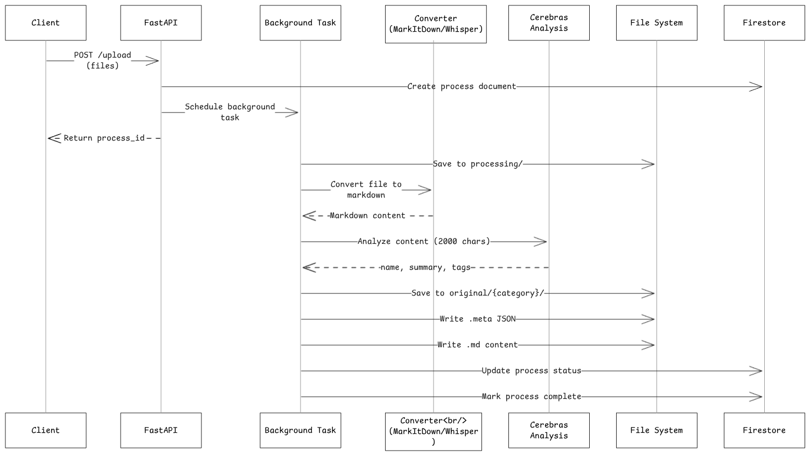

# Helix Backend Service

The Helix Backend Service is a FastAPI-based backend that powers the Helix knowledge management ecosystem. It provides comprehensive content processing capabilities, multi-agent search functionality, and user-isolated storage management for the Helix platform.

## Table of Contents

- [Features](#features)
- [System Architecture](#system-architecture)
- [Multi-Agent Search System](#multi-agent-search-system)
- [User Uploaded Files Directory Structure](#user-uploaded-files-directory-structure)
- [API Endpoints](#api-endpoints)
- [Technology Stack](#technology-stack)
- [Project Structure](#project-structure)
- [License](#license)

## Features

- **File Processing**: Supports 20+ file types including PDF, DOCX, PPTX, XLSX, CSV, TXT, MD, MP3, and MP4
- **URL Processing**: Extract and convert content from GitHub repositories, YouTube videos, Wikipedia articles, X/Twitter posts, Reddit threads, LinkedIn posts, and generic web pages
- **Multi-Agent Search**: Parallel agent execution across different content categories (links, documents, media) with intelligent synthesis
- **User Isolation**: Content storage and processing fully isolated per user
- **AI-Powered Analysis**: Automatic file naming, summarization, and tagging using Cerebras inference
- **Background Processing**: Asynchronous task execution for file conversion and URL processing
- **Authentication**: Clerk-based JWT authentication with username resolution
- **Metadata Management**: Structured metadata storage with original file preservation
- **Process Tracking**: Real-time process status updates via Google Cloud Firestore

## System Architecture



## Multi-Agent Search System


## User Uploaded Files Directory Structure

The service organizes user content in a hierarchical structure with strict isolation:

```
uploads/
└── <user_id>/
    ├── processing/              # Temporary storage during file upload
    ├── original/                # Original files preserved
    │   ├── docs/               # Documents (PDF, DOCX, etc.)
    │   ├── media/              # Audio/Video files (MP3, MP4)
    │   └── links/              # (Empty - links have no original files)
    └── processed/              # Processed metadata and content
        ├── docs/
        │   ├── <filename>.meta # JSON metadata (name, summary, tags)
        │   └── <filename>.md   # Converted markdown content
        ├── media/
        │   ├── <filename>.meta # JSON metadata
        │   └── <filename>.md   # Transcription content
        └── links/
            ├── <link_name>.meta # JSON metadata
            └── <link_name>.md   # Extracted content
```

**File Types:**
- `.meta`: JSON files containing metadata (`old_name`, `name`, `summary`, `tags`)
- `.md`: Markdown content extracted/converted from the source
- Original files: Stored in `original/` with their actual extensions

## API Endpoints

| Method | Path | Auth Required | Description |
|--------|------|---------------|-------------|
| `GET` | `/health` | No | Health check endpoint |
| `POST` | `/upload` | Yes | Upload files for processing (max 10 files) |
| `POST` | `/process-urls` | Yes | Process a list of URLs |
| `POST` | `/upload-single-link` | No | Process single URL without authentication |
| `GET` | `/processes/recent` | Yes | Get user's 5 most recent processes |
| `GET` | `/files/processed` | Yes | List all processed files by category |
| `POST` | `/download` | Yes | Download original file by name and type |
| `DELETE` | `/files` | Yes | Delete file (original + metadata) by name |
| `POST` | `/search` | No | Multi-agent search across user's content |

## Technology Stack

**Core Framework:**
- FastAPI - Web framework with async support
- Uvicorn - ASGI server

**AI & LLM:**
- Cerebras Cloud SDK - Fast inference for powering the agents
- OpenAI API - Whisper transcription (gpt-4o-mini-transcribe)
- OpenRouter - To access model hosted on Cerebras
  
**Content Processing:**
- MarkItDown - Universal document to markdown conversion
- YouTube Transcript API - Video transcript extraction
- BeautifulSoup4 - HTML parsing and web scraping
- Markdownify - HTML to markdown conversion

**Integrations:**
- Google Cloud Firestore - Process tracking and metadata
- Clerk - Authentication and user management
- PyGithub - GitHub repository processing
- Tweepy - X/Twitter API integration
- Wikipedia - Wikipedia article extraction

**Agent System:**
- MCP (Model Context Protocol) - Tool integration for agents
- FastMCP - MCP server implementation

## Project Structure

```
service/
├── src/
│   ├── app.py                  # Main FastAPI application and endpoints
│   ├── schema.py               # Pydantic request/response models
│   └── utils/
│       ├── __init__.py         # Package exports
│       ├── agent.py            # Multi-agent search system and MCP integration
│       ├── ai.py               # Cerebras-based content analysis
│       ├── clerk.py            # Clerk authentication and JWT validation
│       ├── db.py               # Firestore database operations
│       ├── file_helper.py      # MarkItDown document conversion
│       ├── media_helper.py     # Whisper audio/video transcription
│       ├── process_helper.py   # Background processing orchestration
│       ├── tools.py            # MCP server tools (read_file, list_file, grep)
│       └── url_helper.py       # URL content extraction for multiple platforms
├── pyproject.toml              # Project dependencies and metadata
├── uv.lock                     # Dependency lock file
└── README.md                   # This file
```

## License

This project is part of the Helix ecosystem. See the [LICENSE](../LICENSE) file in the root directory for details.